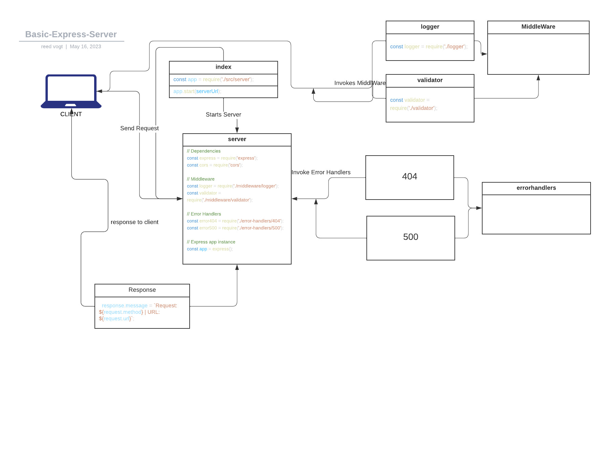

# basic-express-server

Code Fellows - Code 401 - Class 02 Lab

- server deploy: https://basic-express-server.herokuapp.com/

- server prod:

- Github Actions:

- Pull Requests:

  - [PR1](https://github.com/reedoooo/basic-express-server/compare/dev?expand=1)
  - [PR2](https://github.com/reedoooo/basic-express-server/pull/2)

## Server

URL: https://basic-express-server.herokuapp.com

Endpoint: /person

Example: https://basic-express-server.herokuapp.com/person?name=Tha+Human

## UML Architecture

